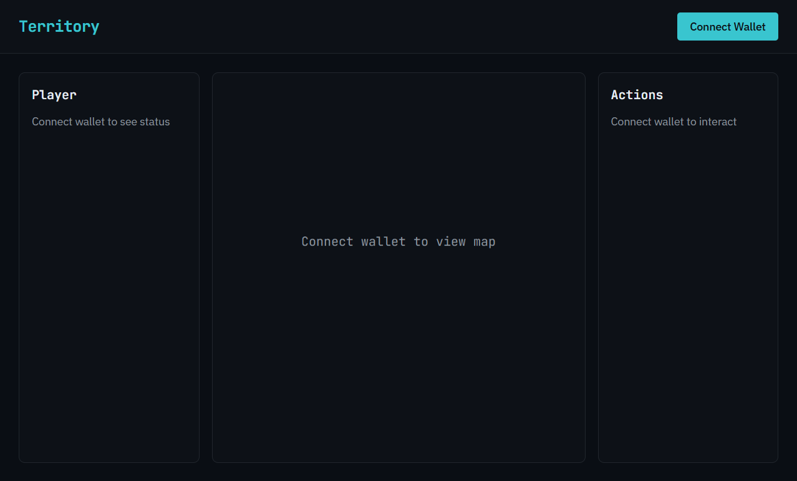
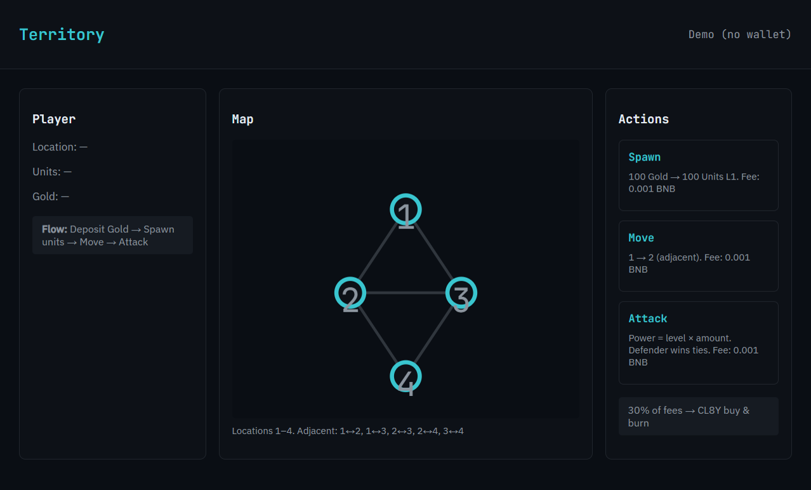

# Territory

[](https://github.com/brouie/territory/actions)
[](LICENSE)

Skill-based GameFi on opBNB/BSC. Fully onchain, deterministic, no RNG. Map-based gameplay with PVE and PVP battles.

## What is Territory?

Territory is an onchain strategy game where outcomes are determined by player decisions, not luck. Deposit Gold, spawn units, move across map locations, fortify your captures for PVP defense, and attack PVE or other players. Combat is deterministic (power = level × amount; defender wins ties). Fees: Move/Spawn 0.00001 BNB, Attack 0.00005 BNB; 30% of fees fund CL8Y buy-and-burn.

## Screenshots

| Map view | Demo UI |
|----------|---------|
|  |  |

## Prerequisites

- [Foundry](https://book.getfoundry.sh/getting-started/installation) (for contracts)
- Node.js 18+ and npm (for webapp)
- MetaMask on opBNB Testnet (chain 5611); tBNB for fees

## Quick start

```bash
# Clone
git clone <repo-url> opbnb && cd opbnb

# Contracts
cd contracts
forge install foundry-rs/forge-std --no-commit
forge install OpenZeppelin/openzeppelin-contracts --no-commit
forge build
forge test

# Webapp
cd ../webapp
npm install
npm run dev
```

Open [http://localhost:3000](http://localhost:3000) or try the static demo at `webapp/public/demo.html`.

## Constraints

- Skill-based, not gambling
- No RNG / no randomness
- Deterministic outcomes only
- Fully onchain core logic
- Map-based gameplay (movement between locations)
- PVE + PVP battles
- AGPL open source
- EVM-based (opBNB / BSC)
- Fees per action: Move/Spawn 0.00001 BNB, Attack 0.00005 BNB
- 30% of all fees routed to buy & burn CL8Y

## Project Structure

```
opbnb/
├── contracts/       # Foundry (Solidity)
├── docs/            # Mechanics and architecture
├── webapp/          # Next.js
├── LICENSE          # AGPL-3.0
└── README.md
```

## Setup

### Contracts

```bash
cd contracts
forge install foundry-rs/forge-std --no-commit
forge install OpenZeppelin/openzeppelin-contracts --no-commit
forge build
forge test
```

### Deployment (opBNB)

Set constructor args for FeeCollector:

- `treasury`: address receiving 70% of fees
- `router`: PancakeSwap V2 router (opBNB: `0x8cFe327CEc66d1C090Dd72bd0FF11d690C33a2Eb`)
- `cl8yToken`: CL8Y token address
- `wbnb`: WBNB on opBNB

## Docs

- [Roadmap](docs/ROADMAP.md) - Phases and next steps
- [Guide](docs/GUIDE.md) - Player guide: deposit, spawn, move, fortify, attack
- [Mechanics](docs/MECHANICS.md) - Core rules, combat formula, fee model
- [Architecture](docs/ARCHITECTURE.md) - Contract layout and data flow

## License

AGPL-3.0
